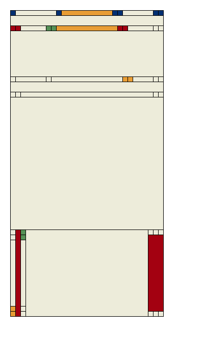
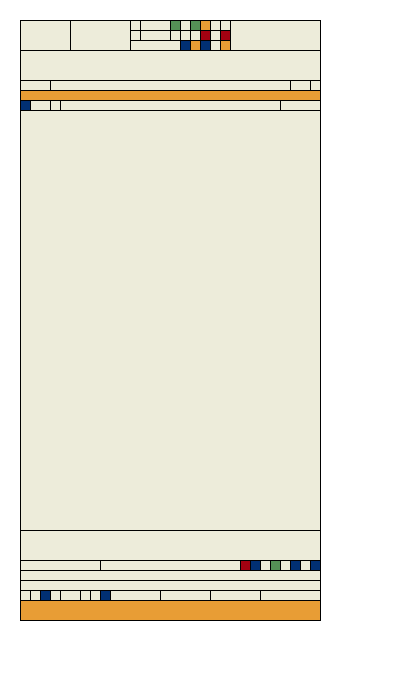
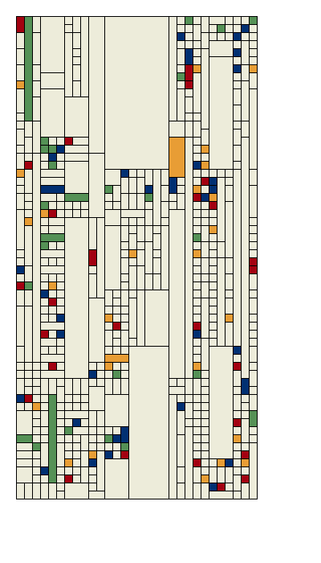
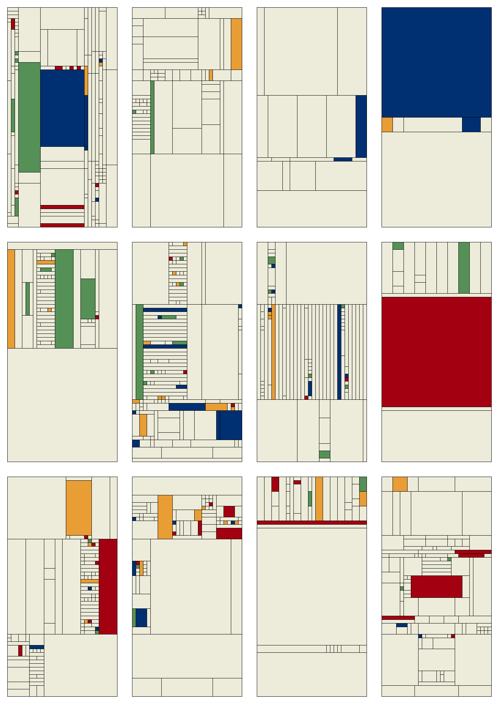

### Motivation

Months ago I found Tyler Hobbs' ["Fidenza"](https://tylerxhobbs.com/fidenza), and was awed by the versatility and sense-of-a-real-person embodied in the series. I had been unfamiliar with the wold of generative art, ignorant that computer-generated outputs could capture some of the algorithm author's sensibilities. (I might even have mentally scare-quoted the term: *generative "art"*.) How wrong I was.

Now, with open eyes, a hacker's background, and no visual art experience, I wanted to get my feet wet.

(Disclaimer: no claim is made on the term "art" as applied to the output of this feet wetting.)

### Target

After reading Tyler's ["Texture Study: Dormant Grass"](https://tylerxhobbs.com/essays/2014/texture-study-dormant-grass), I figured I should start by attempting to replicate something -- an interesting woodgrain or marble countertop, maybe. (Never a bad idea, I think; in my college video game class, our first project was a pixel-perfect remake of a Legend of Zelda level.) While mulling it over I thought of the [Frank Lloyd Wright-inspired drinking glasses](https://www.pinterest.com/pin/283163895290605404/) my parents used to have. I learned online that Wright referred to this design as ["Kinder Symphony"](https://www.metmuseum.org/art/collection/search/9821). With its limited, standard geometries, regular composition, and small color palettes, I figured it would be a perfect candidate for my foray into algorithmic simulation.

### Approach

I took it for granted I'd use Clojure, my hobby language of choice. (I actually found Hobbs' work via Stu's Deref newsletter.) Hobbs' ["Using Quil for Artwork"](https://tylerxhobbs.com/essays/2015/using-quil-for-artwork) pointed me to Quil (which I'd used before only during 2019's Advent of Code, [Day 11](https://adventofcode.com/2019/day/11), part 2) and gave me a direction; now I was off to the races...


### Unrecorded Outputs

... too fast, as it turned out. Foolishly, it was only after some initial ground-laying that I took Tyler's advice and wrote the requisite code for saving each and every one of my output images, so I'm missing the earliest relics.

In my first commit, I roughed things out in a single `core.clj` namespace. I wrote code for:

* Defining a data representation of a color palette using HSB values:

  ```clojure
  (def kinder-palette {:main [57, 8, 93]
                       :accent #{[354, 99, 64]
                                 [121, 41, 57]
                                 [215, 99, 45]
                                 [35, 77, 91]}})
  ```

* Defining a data representation of the artwork -- a rectangle having child rectangles -- and a "seed" for such:

  ```clojure
  (def seed-rect {:dim [30 60]
                  :loc [0 0]
                  :color (:main palette)
                  :children []})
  ```

* Defining a `draw` function for Quil, which traverses my to-be-nested rectangles and draws them, children atop parent


The output is easily imagined: a tall, beige rectangle. Onto more interesting commits...


### First Recorded Output



`output/wip/2021-08-25T15:15:09.876_-1830844798397522574.tif` -- what a beaut!

At this point, I'm taking my seed rectangle and recursively subdividing it into symmetric "triptychs" of randomized distribution. I accomplish this via functions called `vert-sym-children` and `horz-sym-children`. Rectangles may be assigned a randomly-chosen accent color if they are sufficiently small.

The above image would have been generated approx. as follows:

* Begin with the outermost seed rectangle
* Divide it "hamburger-wise" into nearly-even thirds
* Divide the bottom rectangle "hotdog-wise" by drawing one-unit-wide "buns"; divide the top rectangle into a somewhat-even "hamburger"
* Etc.

Already I was having tons of fun -- I felt as I did when writing my first computer program, a command line recipe helper. 

###More Entropy



`2021-08-25T16:07:40.408_-3043675169581344743_added-randomly-spaced-children.tif` -- Now I'm including not only the timestamp and seed, but also the repository's current commit message.

Now, in addition to the randomly-dimensioned triptych division, a rectangle may divide randomly into rectangles as small as one unit.


### Evenly Spaced Children



`/Users/adamsam/workspace/generative/kinder/output/wip/2021-08-25T17:09:47.442_8695693331042542449_added-even-space-child-gen.tif`

Woah! I've added a third method of rectangle division: division of a rectangle into equal segments. Because my algorithm continues to subdivide rectangles aggressively, the result is a tendency toward runs of one-by-ones. Coloring is still basically random -- smaller blocks are more likely to get a randomly-chosen accent color.


### Tweaking Magic Numbers




In no particular order: tweaking parameters.


